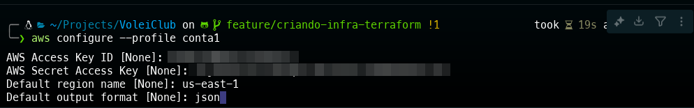
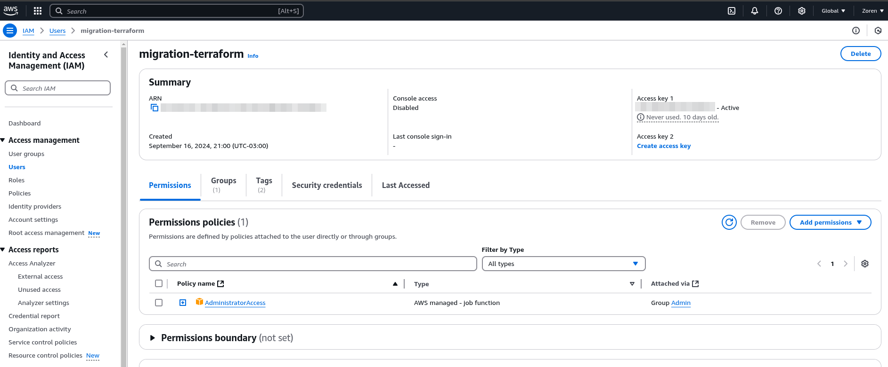
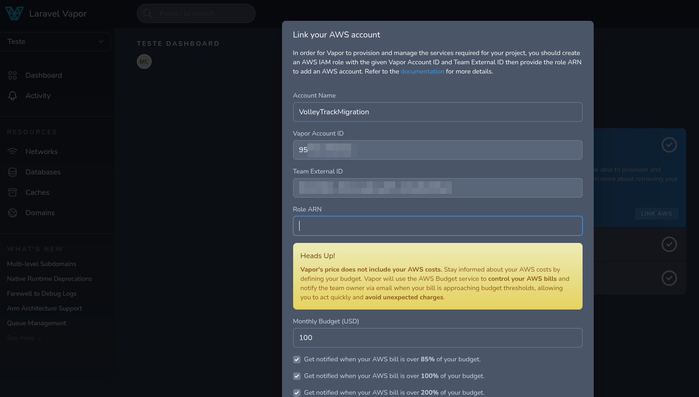
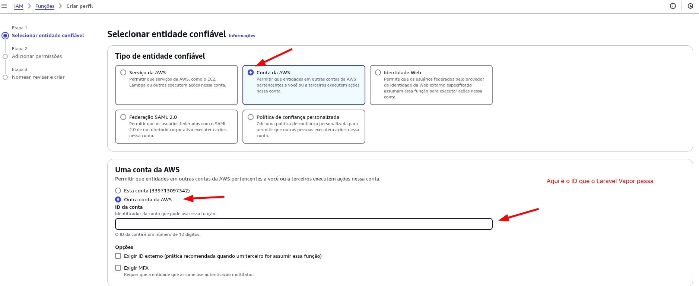
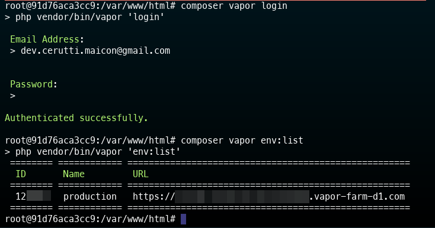
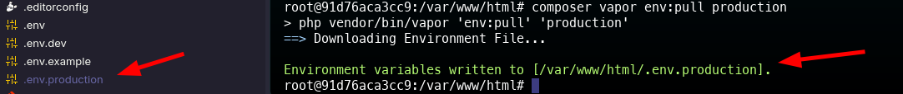

# **Terraform - Provisionamento de Infraestrutura para VoleiTrack**


Este projeto utiliza **Terraform** para provisionar a infraestrutura necessária para o funcionamento do projeto **VoleiTrack**, incluindo a criação de instâncias **RDS**, clusters **Redis**, e registros **DNS** no **Route 53**.

## Índice
- [**Terraform - Provisionamento de Infraestrutura para VoleiTrack**](#terraform---provisionamento-de-infraestrutura-para-voleitrack)
  - [Índice](#índice)
  - [**Estrutura do Projeto**](#estrutura-do-projeto)
  - [**Pré-requisitos**](#pré-requisitos)
    - [🏗️ **Terraform**](#️-terraform)
    - [☁️ **AWS CLI**](#️-aws-cli)
      - [🔧 **Instalação Ubuntu**](#-instalação-ubuntu)
    - [Conta 1](#conta-1)
    - [Conta 2](#conta-2)
    - [Passos para configurar Conta1 e Conta2 AWS CLI](#passos-para-configurar-conta1-e-conta2-aws-cli)
  - [Passos para criar as credenciais na conta 2](#passos-para-criar-as-credenciais-na-conta-2)
  - [Configuração no Laravel Vapor](#configuração-no-laravel-vapor)
    - [Criar Projeto no Laravel Vapor](#criar-projeto-no-laravel-vapor)
    - [Criar Role no AWS IAM, para o Laravel Vapor](#criar-role-no-aws-iam-para-o-laravel-vapor)
    - [Criar Banco de Dados no Laravel Vapor](#criar-banco-de-dados-no-laravel-vapor)
    - [Criar Banco de Cache no Laravel Vapor](#criar-banco-de-cache-no-laravel-vapor)
    - [Criar Relacionamento entre o Projeto Laravel Vapor e o Repositório](#criar-relacionamento-entre-o-projeto-laravel-vapor-e-o-repositório)
  - [Variáveis de Ambiente Laravel Vapor](#variáveis-de-ambiente-laravel-vapor)
    - [**Arquivos `.env`**](#arquivos-env)
  - [**Como Executar o Projeto**](#como-executar-o-projeto)
    - [**Passos para Provisionar a Infraestrutura**](#passos-para-provisionar-a-infraestrutura)
      - [0. Selecione o ambiente desejado (`conta1` ou `conta2`).](#0-selecione-o-ambiente-desejado-conta1-ou-conta2)
      - [**1. Inicializar o Terraform**:](#1-inicializar-o-terraform)
      - [**2. Validar o Plano**:](#2-validar-o-plano)
      - [**3. Aplicar o Plano**:](#3-aplicar-o-plano)
  - [Migração Route 53 no Laravel Vapor](#migração-route-53-no-laravel-vapor)
    - [**Verificando os Registros DNS**](#verificando-os-registros-dns)
  - [**Rollback ou Destruição da Infraestrutura**](#rollback-ou-destruição-da-infraestrutura)
  - [**Estrutura do Módulo `route53`**](#estrutura-do-módulo-route53)
    - [**Exemplo de Uso**:](#exemplo-de-uso)
  - [**Importante**](#importante)
    - [**Registros NS e SOA**](#registros-ns-e-soa)
    - [**Variáveis de ambiente no novo Ambiente Produção**](#variáveis-de-ambiente-no-novo-ambiente-produção)
  - [**Contribuições**](#contribuições)
  - [**Autor**](#autor)

## **Estrutura do Projeto**
A estrutura do projeto segue o seguinte formato:

```bash
/terraform/
    /modules/
        /db/           # Módulo para criação do banco de dados RDS
        /redis/        # Módulo para criação do cluster Redis
        /route53/      # Módulo para gerenciamento dos registros DNS no Route 53
    /environments/
        /conta1/       # Ambiente para a Conta 1
        /conta2/       # Ambiente para a Conta 2
```
## **Pré-requisitos**

### 🏗️ **Terraform**
- Versão **1.0.0 ou superior**.
- [Tutorial de instalação](https://learn.hashicorp.com/tutorials/terraform/install-cli) 🔗

### ☁️ **AWS CLI**
- Deve estar configurado com os perfis das contas `conta1` e `conta2`.

#### 🔧 **Instalação Ubuntu**

```bash
sudo apt update
sudo apt install awscli
```

### Conta 1

Deve ser as credenciais da conta principal atual onde existem os dados e onde é o servidor principal de produção.

### Conta 2

Deve ser as credenciais da conta onde será feito o backup e onde será feito o servidor de produção secundário (migration).

### Passos para configurar Conta1 e Conta2 AWS CLI

```bash
aws configure --profile conta1
```

Preencha as informações quando solicitado:

```bash
AWS Access Key ID: Chave de acesso da conta 1
AWS Secret Access Key: Chave secreta da conta 1
Default region name: us-east-1
Default output format: json
```

> Repita o processo para a conta 2, trocando o nome do perfil e as credenciais.

Deve ficar como na imagem abaixo:




## Passos para criar as credenciais na conta 2

1. Para garantirmos que a conta 2 tenha acesso a conta 1, é necessário criar um usuário na conta 1 e dar permissão de acesso a conta 2.

2. Na conta 1, acesse o console da AWS e vá até o serviço **IAM**.

3. Crie um novo usuário com permissões de acesso programático. Minha sugestão de nome é `terraform-migration`.

4. Adicione as permissões necessárias para o usuário, ter acesso as ações na AWS, utilize essa para conceder acesso total:

```text
AdministratorAccess
```

Deve ficar como na imagem abaixo:




5. Após a criação do usuário, copie as credenciais de acesso (chave de acesso e chave secreta). Você vai precisar delas para configurar o Terraform e variáveis de ambiente nos passos seguintes.

6. Agora, na conta 2, acesse o console da AWS e vá até o serviço **IAM**.

7. Crie um novo usuário com permissões de acesso programático. Minha sugestão de nome é `terraform-migration`.

8. Adicione as permissões necessárias para o usuário, ter acesso as ações na AWS, utilize essa para conceder acesso total:

```text
AdministratorAccess
```

9.  Após a criação do usuário, copie as credenciais de acesso (chave de acesso e chave secreta).

10.  Adicione essas credenciais da conta 1 e conta 2 no arquivo `terraform/.env`.

11.  Adicione as credenciais da conta 1 e conta 2 no arquivo `terraform/environments/conta2/terraform.tfvars` também.

12.  Após a configuração das credenciais, você pode prosseguir com o provisionamento da infraestrutura.

13. **Importante**: Após a conclusão do provisionamento, remova as credenciais do arquivo `.env` e `terraform/environments/conta2/terraform.tfvars` para garantir a segurança das informações.

## Configuração no Laravel Vapor

### Criar Projeto no Laravel Vapor

Para iniciar, crie um Projeto no Laravel Vapor pode criar com qualquer nome, mas esse projeto provisionará toda a infraestrutura dos nossos projetos Backend, o do Multi Tenancy e o Landing Page. Eu geralmente o crio com o nome `VolleyTrack Production`.

### Criar Role no AWS IAM, para o Laravel Vapor

Após fazer isso você terá que linkar o projeto com a conta da AWS. Lá ele pedirá algumas informações como na imagem abaixo:



Repare que ali existe um link para a documentação do Laravel Vapor para fazer a Role que ele precisa para fazer o deploy, você pode seguir esse passo a passo para criar a Role. 

[Link para a documentação](https://docs.vapor.build/introduction#linking-with-aws).

A Role deve ser criada da seguinte maneira (apenas para ficar mais visivel):



No Laravel Vapor faça o link com a conta da AWS e siga os passos para criar a Role.


### Criar Banco de Dados no Laravel Vapor

Após isso, você deve criar um banco de dados pela interface do Laravel Vapor, e adicionar as credenciais no arquivo .env e no arquivo `terraform/environments/conta2/terraform.tfvars`.

O banco de dados deve ter o nome `volleytrack` para tudo funcionar corretamente.

### Criar Banco de Cache no Laravel Vapor

Aproveite também e crie o banco redis, de cache, o nome deve ser `volleytrack-cache`.

### Criar Relacionamento entre o Projeto Laravel Vapor e o Repositório

Crie também o Projeto na interface do Laravel Vapor, isso é importante pois lá ele vai solicitar que o arquivo vapor.yml seja adicionado ao repositório, como ele já esta, basta copiar o endereço do repositório e adicionar no Laravel Vapor, copie com atenção, pois algumas alterações específicas do projeto não precisam ser alteradas.

> Isso é o que vai vincular o Laravel Vapor com o repositório e permitir que ele faça o deploy automaticamente.

Isso é muito importante para garantir que o banco de dados seja criado corretamente e que as credenciais estejam corretas, para conseguir migrar os dados com o Migration Database Service da AWS.

Algumas variáveis de ambiente como a senha devem ser configuradas no arquivo `.env` e no arquivo `terraform/environments/conta2/terraform.tfvars` para garantir que o banco de dados seja criado corretamente.

> É importante que o banco de dados seja criado antes de rodar o Terraform, para garantir que as credenciais estejam corretas e que o banco de dados seja criado corretamente, pois o Laravel Vapor o gerencia automaticamente.

Não esqueça de copiar todos os Projetos do Laravel Vapor e configurar o GitHub endereco do repositório.

## Variáveis de Ambiente Laravel Vapor

Agora, na conta do Laravel Vapor que tem as informações de produção, também é necessário que você busque as variáveis de ambiente do Laravel Vapor que são de produção, do .env.production, pois será necessário para recuperar os valores implementados em produção.

Comandos para buscar as variáveis de ambiente do Laravel Vapor:

```bash
composer vapor env:list
```
Deve mostrar algo como na imagem abaixo:



```bash
composer vapor env pull production
```

Deve mostrar algo como na imagem abaixo:



Após isso, você terá um arquivo `.env.production` com as variáveis de ambiente do Laravel Vapor, copie essas variáveis, faça backup e mantenha o arquivo por segurança.

Logo utilizaremos isso para enviar para produção novamente, mas para o outro ambiente de projeto no Laravel Vapor.

### **Arquivos `.env`**
Dentro da pasta `terraform/environments/conta1/` e `terraform/environments/conta2/`, crie um arquivo `.env` com as seguintes variáveis:

**terraform/.env**
```env
AWS_ACCESS_KEY_ID_CONTA1=<chave_de_acesso_conta1>
AWS_SECRET_ACCESS_KEY_CONTA1=<chave_secreta_conta1>

AWS_ACCESS_KEY_ID_CONTA2=<chave_de_acesso_conta2>
AWS_SECRET_ACCESS_KEY_CONTA2=<chave_secreta_conta2>

```

Após isso configurar as variáveis de ambiente do terraform:

**terraform/environments/conta2/terraform.tfvars**
```terraform
# AWS credentials
AWS_ACCESS_KEY_ID     = ""
AWS_SECRET_ACCESS_KEY = ""
DB_PASSWORD           = ""

# Target DB (conta 2)

## Endpoint do banco de dados (Origem)
target_db_endpoint    = ""
target_db_name        = ""
target_db_password    = ""
target_db_user        = "vapor"

## Endpoint do banco de dados (Destino)
source_db_endpoint    = ""
source_db_name        = "vapor"
source_db_password    = ""
source_db_user        = "vapor"
```

Preencha os valores das chaves de acesso, e após isso, renomeie o arquivo `terraform/environments/conta2/terraform.tfvars` para `terraform/environments/conta2/terraform.tfvars.secret`.

Esses arquivos serão utilizados pelo Terraform para provisionar os recursos em suas respectivas contas.

## **Como Executar o Projeto**

### **Passos para Provisionar a Infraestrutura**

#### 0. Selecione o ambiente desejado (`conta1` ou `conta2`).

```bash
export AWS_PROFILE=conta2
```

> Tenha absoluta certeza de que está utilizando o perfil correto antes de prosseguir.
> Verifique a criação do banco de dados feita no Laravel Vapor se esta tudo ok! E credenciais do banco de dados no arquivo `terraform/environments/conta2/terraform.tfvars` antes de prosseguir.

#### **1. Inicializar o Terraform**:

Em cada ambiente (por exemplo, `terraform/environments/conta2/`), rode o comando:

```bash
terraform init
```

#### **2. Validar o Plano**:

Para garantir que o plano de infraestrutura está correto, execute:

```bash
terraform plan -var-file="terraform.tfvars.secret"
```

#### **3. Aplicar o Plano**:

Para provisionar a infraestrutura, execute:

```bash
terraform apply -var-file="terraform.tfvars.secret"
```

Confirme com `yes` quando solicitado.

```bash
yes
```

## Migração Route 53 no Laravel Vapor

Para migrar o Route 53 no Laravel Vapor, você deve adicionar o domínio no Laravel Vapor e configurar o DNS na AWS.

Verificar na implementação do dominio o endereço do CloudFront e adicionar o CNAME no Route 53. (Verifique como esta no ambiente de produção e deixe com as novas variáveis para a migração).

Após isso, você deve adicionar o domínio no Laravel Vapor e configurar o DNS na AWS.


### **Verificando os Registros DNS**

Após o provisionamento, você pode verificar os registros DNS no console do **AWS Route 53** ou utilizar o comando `dig` para confirmar que os registros **A**, **MX**, **CNAME**, e outros foram criados corretamente.

## **Rollback ou Destruição da Infraestrutura**

Se for necessário remover a infraestrutura provisionada, você pode usar o seguinte comando:

```bash
terraform destroy
```

Isso irá remover todos os recursos que foram criados pelo Terraform. **Use com cautela em ambientes de produção**.

## **Estrutura do Módulo `route53`**

O módulo de **Route 53** gerencia a criação de registros DNS. Ele suporta a criação de registros **A**, **CNAME**, **TXT**, **MX**, e outros, conforme definido no código do Terraform.

### **Exemplo de Uso**:

O módulo `route53` é configurado para criar registros como:

- **A Record**: `volleytrack.com` apontando para `76.76.21.21`.
- **CNAME Record**: `api.volleytrack.com` e `graphql.volleytrack.com` apontando para aliases CloudFront.
- **TXT Record**: Para validação do Amazon SES.
- **Wildcard A Record**: Para qualquer subdomínio (`*.volleytrack.com`).

Você pode configurar esses registros no arquivo de variáveis do Terraform.

## **Importante**

### **Registros NS e SOA**

**Não é necessário recriar os registros NS e SOA manualmente**, pois eles são criados automaticamente pelo **AWS Route 53** ao provisionar a zona hospedada. Esses registros estão comentados no código e servem como referência.

### **Variáveis de ambiente no novo Ambiente Produção**

Após a migração, você deve adicionar as variáveis de ambiente do Laravel Vapor no novo ambiente de produção, para garantir que o ambiente esteja configurado corretamente.

```bash
composer vapor env:push production
```

Isso irá enviar as variáveis de ambiente do arquivo `.env.production` para o ambiente de produção no Laravel Vapor.

Utilize os mesmos valores encontrados no ambiente de produção original, para garantir que o novo ambiente esteja configurado corretamente.

## **Contribuições**

Sinta-se à vontade para contribuir com melhorias ou ajustes necessários. Basta abrir um **Pull Request**.


## **Autor**

Este projeto foi desenvolvido por **Maicon Cerutti** com o objetivo de automatizar o provisionamento da infraestrutura do **VoleiTrack** utilizando **Terraform** e **AWS**.